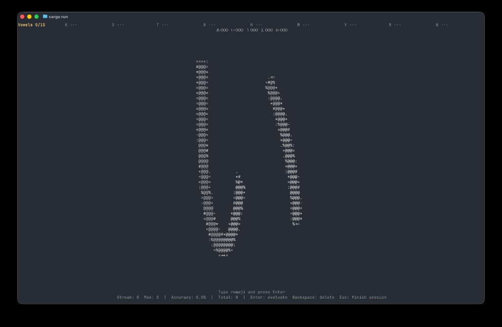

# 🇯🇵 Gojuon Quest (TUI) 🎮

Sharpen your hiragana reading in a cozy terminal quiz game with a little matsuri vibe.
Type the romaji for each kana, build streaks, and climb toward mastery one column at a time. 🍵

## 📸 Screenshot



## ✨ What this is

This project is a Rust terminal quiz game focused on **hiragana recognition**.

- 🧠 **Kana prompt + romaji answer**: see a hiragana character, type its romaji
- 🎯 **Practice-first flow**: instant right/wrong feedback after each answer
- 📊 **Stats you can track**: accuracy, streak, max streak, and weakest column
- 🖼️ **Two render styles**: Braille pixel-art or ASCII fallback

## 🕹️ Game modes

- ♾️ **Infinite**: endless practice
- 🧪 **Best of 20**: fixed 20-question session
- 🧗 **Progressive**: unlock hiragana columns by mastering each one

In progressive mode, each kana must be answered correctly multiple times before the next column unlocks.

## 🗂️ Kana columns

For Infinite and Best of 20, you can choose which columns are active:

- Vowels
- K
- S
- T
- N
- H
- M
- Y
- R
- W

## 🛠️ Setup and run

### Prerequisites

- Rust toolchain (`cargo`, `rustc`) via [rustup](https://rustup.rs/)

### Run in development

```bash
git clone git@gitlab.com:ohvitorino/japanese.git
cd japanese
cargo run
```

### Build and run release binary

```bash
cargo build --release
./target/release/gojuon-quest
```

## ⌨️ Controls

### Main menu

- `↑` / `↓` or `j` / `k`: move selection
- `←` / `→`: toggle render style (Braille / ASCII)
- `Enter`: choose mode
- `Esc`: quit

### Column selection screen

- `↑` / `↓` or `j` / `k`: move between columns/actions
- `Enter` / `Space` on a column: toggle it on or off
- `s` or `Enter` / `Space` on Start: begin game
- `Esc`: return to menu

### During quiz

- Type romaji characters
- `Backspace`: delete one character
- `Enter`: submit answer
- `Esc`: return to menu

### Feedback screen

- `Enter` / `Space`: advance to next kana
- `Esc`: return to menu

## 🌸 Contributing

Contributions are welcome. Arigatou! 🙏

1. Fork the repository
2. Create a feature branch (`git checkout -b feat/your-change`)
3. Make your changes
4. Run checks (`cargo fmt`, `cargo clippy`, `cargo test`)
5. Open a Pull Request with a clear description

Great contribution ideas:

- Add katakana mode or mixed kana drills
- Add configurable quiz lengths and difficulty presets
- Improve cross-platform font/render behavior

---

Made for kana practice, one prompt at a time. がんばって! 💮
